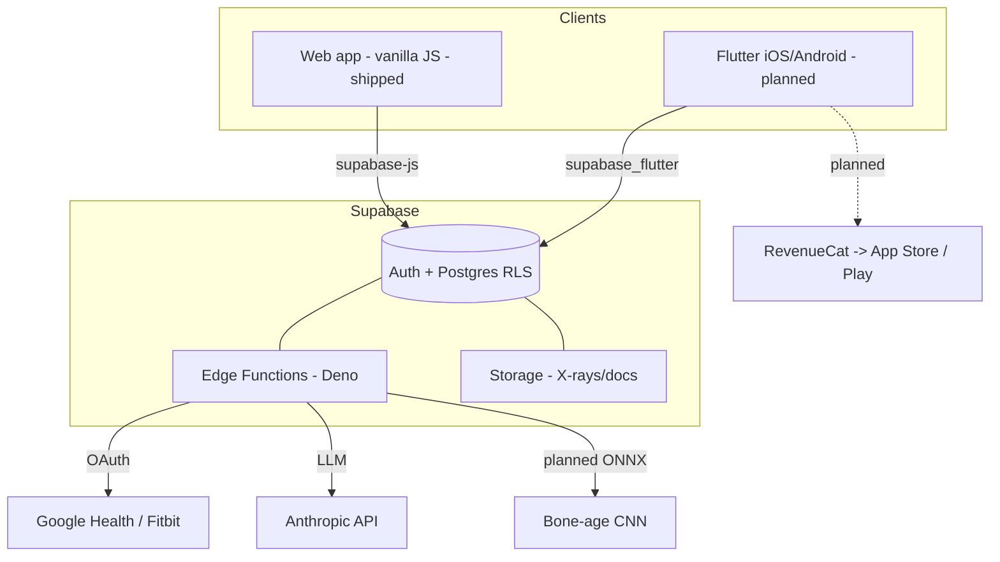
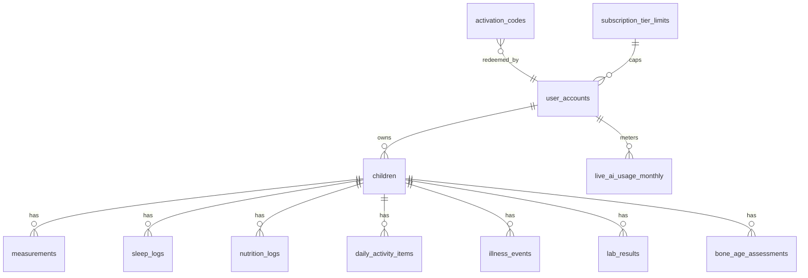

# GrowSense OS — Engineering & Product Handbook

**The official source of truth for GrowSense OS**
Pediatric Growth Intelligence Platform

*Version 1.0 · Prepared for future developers, AI engineers, product managers, clinical advisors, and due-diligence reviewers.*

---

> **Purpose of this document.** This handbook is written so that a completely new team — engineers, designers, clinicians, or an acquirer's technical reviewers — can pick up GrowSense OS and continue development even if the original founder is unavailable. It documents not just *what* exists, but *why* each decision was made, *how* the systems work today, and *where* they are headed. Where the current production build (a vanilla-JS web app on GitHub Pages + Supabase) diverges from the target architecture (native iOS/Android via Flutter), both are described, with an explicit migration path.

> **Reading note on honesty.** This handbook distinguishes carefully between **shipped** (running in production today), **scaffolded** (schema/stubs exist, logic partial), and **planned** (design only). A handbook that overstates maturity is worse than useless during due diligence. Each major feature carries a status tag.

---

## Table of contents

1. Executive Vision
2. Product Overview
3. System Architecture
4. Database Architecture
5. Pediatric Growth Science Handbook
6. Nutrition Intelligence Engine
7. Activity Intelligence Engine
8. Sleep Intelligence Engine
9. Growth Readiness™
10. Growth Prediction Engine
11. Bone Age AI Platform
12. AI Coach
13. UX/UI Design System
14. API Handbook
15. Security & Privacy
16. Research Platform
17. Future Roadmap
+ Appendix A: Flutter / iOS / Android migration playbook
+ Appendix B: UI research digest (2026 premium health-tech)

---

# Section 01 — Executive Vision

## Mission

To transform childhood growth monitoring from **observation** into **intelligence**: not just recording how tall a child is today, but explaining which biological factors are shaping their growth and how those factors can be supported.

## Vision

Most growth tools are passive ledgers — they record a height and plot a dot on a percentile curve. GrowSense OS treats growth as the output of an interacting biological system (endocrine signalling, sleep architecture, nutrition, physical loading, illness burden, genetics) and surfaces that system to parents and, eventually, clinicians in a form they can act on.

The strategic bet mirrors what the broader wearables category has already proven: the winning layer is no longer the raw metric, it is the **interpretive layer** on top of it. The market has moved "from dashboards to dialogue" — Oura Advisor and WHOOP Coach now narrate *why* a score changed rather than dumping numbers. GrowSense applies the same principle to pediatric growth: the AI Coach is the interpretive layer over the measurement substrate.

## Company philosophy

- **Evidence over vibes.** Every score weight, every activity multiplier, every nutrient target traces to a defensible source. When the evidence is weak, the app says so rather than inventing precision. (See the activity reclassification in Section 07 for a concrete example: swimming and cycling were *demoted* because they carry no osteogenic loading benefit, even though a naive product would happily reward them.)
- **Honest uncertainty.** Percentile bands shown in-app are labelled as illustrative trend curves, not a substitute for a clinic's official chart. Bone-age output is labelled educational, not diagnostic. This is both an ethical stance and a regulatory survival strategy.
- **Parent-first, clinician-ready.** The primary user is a health-conscious parent. But every artifact (PDF clinic summary, growth history, target-height estimate) is built so it can be handed to a pediatrician without embarrassment.
- **Build to production quality in focused passes.** The project has historically shipped complete, working features in single sessions rather than long-lived prototypes.

## Long-term goals

| Horizon | Goal |
|---|---|
| Near | A polished multi-language parent app across priority Asian + Middle-Eastern markets, with reliable growth tracking, nutrition/sleep/activity logging, and an interpretive AI Coach. |
| Mid | Quantitative, calibrated bone-age estimation; a validated Growth Readiness™ biomarker; native iOS/Android apps. |
| Long | A clinical decision-support posture (clinician dashboards, assigned-child access), a de-identified research dataset, and category leadership in "Growth Intelligence." |

## "Growth Intelligence" — definition

The synthesis of multi-domain child data (anthropometry, wearable sleep, nutrition, activity, labs, bone age, genetics) into **explanations and forecasts** of growth, rather than static records. It is the category GrowSense intends to define.

## "Growth Readiness™" — definition

A proprietary daily digital biomarker (0–100) summarising how supportive today's inputs are for growth — analogous to how Oura's Readiness or WHOOP's Recovery compress many signals into one glanceable number. Full methodology in Section 09. Current status: **shipped (deterministic v1)**; ML replacement is **planned**.

## Target users

1. **Primary — health-conscious parents** in height-attentive markets. Expansion sequence: Thailand → Vietnam → Taiwan → Hong Kong → South Korea → China → UAE.
2. **Secondary — pediatricians / endocrinologists** who receive shared summaries or (future) hold assigned-child clinician access.
3. **Future — researchers** consuming the de-identified dataset.

## Business model

- **Freemium subscription.** A free tier with hard caps (measurement count, monthly AI questions), and paid **Premium** / **Pro** tiers unlocking lab-value tracking, higher AI limits, and advanced features. Status: **shipped foundation** — tier fields, expiry, billing-source tracking, and activation-code redemption are live (Sections 04, 14). Payment processor integration (Stripe / Apple IAP / Google Play Billing) is **planned**.
- **Activation codes** enable partner-clinic and card-based distribution independent of app-store billing — a deliberate lever for markets where app-store penetration or card usage is uneven.

## Competitive landscape

| Category | Examples | GrowSense difference |
|---|---|---|
| Generic growth trackers | Baby/child height-weight loggers, WHO chart apps | They record; GrowSense explains and forecasts, and integrates sleep/nutrition/activity/labs. |
| Wearable ecosystems | Oura, WHOOP, Apple Health, Garmin | Adult-recovery focused; GrowSense is pediatric-growth focused and *consumes* their sleep data rather than competing on hardware. |
| Clinical growth software | Hospital EMR growth modules | Clinician-only, not parent-facing, not longitudinal-at-home. |
| Bone-age tools | Research/clinical AI bone-age models | Typically standalone and clinician-only; GrowSense folds bone age into a consumer growth-forecasting loop (with appropriate caveats). |

The defensible moat is the **integrated longitudinal dataset per child** plus the interpretive AI layer — not any single metric.

---

# Section 02 — Product Overview

GrowSense OS is organised around a small number of tabs, deliberately mirroring the progressive-disclosure model that Oura and WHOOP converged on (glanceable "today" → detailed vitals → long-term trends).

### Parent app (shipped)

The core surface. A parent creates one or more child profiles and logs/reviews data.

### Child profiles (shipped)

Multiple children per parent account. Each child carries biological sex, birth date, parental heights (for target-height calculation), and wearable-account linkage fields. Profiles are shown as collapsible cards on the Account screen.

### Growth tracking (shipped)

Height/weight measurements over time, with:
- Tap-to-edit measurement rows (edit/delete sheet).
- Height-for-age percentile and Z-score against a WHO reference.
- BMI + BMI percentile + classification.
- Height velocity computed from the last two measurements.
- Soft-delete on measurements (deleted rows are retained for integrity and to prevent a "rotate-and-relog" exploit against the free-tier measurement cap).

### AI Coach (shipped)

A chat surface that answers parent questions grounded in that child's actual data (latest measurement, percentile, BMI, velocity, target height, SGA catch-up status, recent labs, puberty events, 7-day trends). Backed by a curated question library with category chips, and a live-LLM mode gated by subscription tier. Full detail in Section 12.

### Bone Age AI (shipped v1 → upgrade planned)

Upload a hand X-ray image; receive an estimated bone age with reasoning, an image-quality assessment, an optional Greulich-Pyle plate match, an AI-vs-doctor comparison view, and a clinical caveat. Current engine is a vision-LLM approach; the **planned** replacement is a calibrated ResNet18 + gender-fusion CNN exported to ONNX (Section 11). DICOM (.dcm) ingestion for calibrated mm/pixel measurement is **planned**.

### Growth prediction (partial)

Target adult height via a mid-parental method (with a parents-only validated estimate always shown, plus an exploratory variant). Height velocity and SGA catch-up velocity (in SDS/year — the real clinical definition, not raw cm/year) are computed. A full ML forecasting engine is **planned** (Section 10).

### Nutrition tracking (shipped)

Daily logging of growth-relevant nutrients (protein, calcium, zinc, water, etc.) with per-tap saving. Regional food presets are **planned** (Section 06).

### Sleep tracking (shipped)

Wearable OAuth (Google Health / Fitbit) syncs sleep with stage parsing (deep, REM, efficiency), handling the API's UTC timestamps and offset strings. Manual entry also supported. Wearable-account mismatch detection guards against a parent accidentally syncing their own ring's data onto a child (Section 08).

### Activity tracking (shipped)

A 30-activity evidence-based library across four osteogenic tiers (Section 07), replacing the earlier fixed steppers. Custom activity creation, per-tap saving to `daily_activity_items`.

### Laboratory tracking (partial / Premium)

Lab biomarkers (IGF-1, Vitamin D, ferritin) are surfaced as a **Premium-gated** feature. **Important status note:** in the current build the medical/lab screen does not yet persist to a dedicated backend table for all fields — some lab entry paths keep values in session only. This is flagged in code and must be resolved before lab tracking is advertised as durable. See Section 04.

### Illness tracking (shipped, event-based)

Illness is modelled as discrete episodes (`illness_events`) with real start/end dates, replacing an earlier awkward "illness days this month" single number — a shape correction driven by real user feedback.

## Representative user journeys

**Journey A — New parent, first week.**
Install → create child profile (sex, DOB, parental heights) → log first height/weight → see percentile + target-height estimate → connect Fitbit for sleep → log nutrition and one activity → open AI Coach and ask "should I worry about a low percentile?" → receive a grounded, caveated answer.

**Journey B — Returning parent, monthly cadence.**
Open app → Today tab surfaces the one thing that matters (Readiness + any unusual metric) → add this month's measurement → review velocity trend on Analytics → export a clinic PDF before the pediatrician visit.

**Journey C — Bone-age curiosity.**
Parent has a hand X-ray from a clinic → uploads image → receives educational bone-age estimate with explicit "not a diagnosis" caveat and a prompt to discuss with their doctor.

**Journey D — Partner-clinic activation.**
Clinic hands parent an activation card → parent enters `GROW-XXXX-XXXX` in Account → server validates, upgrades tier, sets expiry, marks code used → Premium features unlock.

---

# Section 03 — System Architecture

## Two architectures, one product

GrowSense OS currently ships as a **web application**; the target is **native mobile** (iOS + Android) via **Flutter**. This section documents both and the bridge between them. The backend (Supabase) is shared and is the stable anchor across the migration — a deliberate choice so that the mobile rebuild is a *client* rewrite, not a full-stack rewrite.

### Current production architecture (shipped)

```
Parent's browser (iOS Safari / Android Chrome / desktop)
        │  static assets over HTTPS
        ▼
GitHub Pages  ── index.html · app.js (vanilla JS) · locales/*.json · ar-rtl.css
        │  supabase-js client
        ▼
Supabase (Singapore region, free plan)
   ├── PostgreSQL (RLS-enforced)
   ├── Auth (JWT sessions)
   ├── Storage (X-ray images, documents)
   └── Edge Functions (Deno) — redeem-code, bone-age, AI proxy, wearable sync
        │
        ├── Google Health / Fitbit APIs (OAuth, sleep data)
        └── Anthropic API (AI Coach live mode, vision bone-age v1)
```

Stack specifics:
- **Frontend:** HTML + CSS + vanilla JavaScript. No framework. State is held in a global `APP` object; daily-log state is keyed per child so switching children never bleeds one child's half-entered numbers into another's form.
- **i18n:** locale JSON files (`en, th, zh, ko, vi, ar`), a `t(key, fallback)` lookup with four fallback layers that never throws, and `data-i18n` attributes on HTML. Arabic uses RTL via `ar-rtl.css` with direction switching on the `<html>` element. Key naming is `screen.component.element` snake_case — deliberately chosen to be portable to Flutter ARB / i18next.
- **Hosting:** GitHub Pages. **Known operational caveat:** GitHub Pages deployment status is unreliable — treat deploy timeouts as infrastructure noise and verify via the live URL, not the workflow badge. Mitigations already applied: `.nojekyll` added, redundant workflow removed.
- **Client factory:** the Supabase client is created via a shared `createGrowSenseClient()` factory rather than inline keys.

### Target mobile architecture (planned — see Appendix A)

```
iOS app  ┐                          Android app ┐
 (Flutter, Impeller)                (Flutter, Impeller)
         └──────────── single Dart codebase ─────────────┘
                              │
                    supabase_flutter SDK
                              ▼
                     Supabase (unchanged)
                              │
                     RevenueCat (IAP/subscriptions)
                              │
              Apple App Store  ·  Google Play Billing
```

- **State management:** Riverpod (the 2026 default for new Flutter apps: async-first, compile-time safe, no `BuildContext` coupling). Bloc is the alternative if a larger team wants stricter event discipline.
- **Pattern:** MVVM + feature-first folders (Flutter's officially recommended pairing), domain/use-case layer added only where it earns its keep.
- **Navigation:** GoRouter (deep links matter for activation codes and clinic share links).
- **Immutability:** Freezed for model + state classes.
- **Monetisation:** RevenueCat in front of Apple/Google billing, writing back to the same `subscription_tier` / `tier_expires_at` fields the activation-code path already uses — so the tier model is billing-source-agnostic.

### AI layer

- **LLM systems:** AI Coach (interpretive/dialogue), bone-age vision v1. Called via Supabase Edge Functions so keys never touch the client and server-side rate/tier gates are enforceable.
- **ML systems (planned):** ONNX bone-age CNN running server-side in an Edge Function; future growth-forecasting model.
- **Recommendation engine (planned):** ranks coaching suggestions (Section 12).

### Storage

Supabase Storage holds X-ray images and documents. Access is scoped by RLS/signed URLs. Medical images are the most sensitive artifact class and are governed by Section 15.

### Architecture diagram (Mermaid)


# Section 04 — Database Architecture

## Purpose and conventions

The database is **PostgreSQL on Supabase**, with **Row-Level Security (RLS)** as the primary access-control mechanism: a parent can only see their own children's data, a clinician only children explicitly assigned to them. RLS enforcement at the database layer means a compromised or buggy client cannot exfiltrate another family's data.

**Status legend for tables below:** ✅ shipped · 🟡 partial (exists but incomplete write/read path) · 🔵 planned.

A note on naming: the product is transitioning from an earlier "BioGrowth OS" identity to "GrowSense OS." Some legacy artifacts and column comments may still reference the old name; treat them as equivalent.

## Data dictionary

### `user_accounts` ✅ (subscription foundation shipped)

**Purpose.** One row per parent/clinician account. Holds subscription tier, expiry, and usage counters. This is the spine of the freemium model.

| Field | Type | Notes |
|---|---|---|
| `user_id` | uuid (FK → auth.users) | Owner. |
| `subscription_tier` | text | `free` \| `premium` \| `pro`. |
| `tier_expires_at` | timestamptz | NULL = free-forever or lifetime grant; populated = timed access. Written by codes, Stripe, Apple, Google, admin alike. |
| `billing_source` | text | `none` \| `code` \| `stripe` \| `apple` \| `google` \| `admin`. Makes tier grants source-agnostic. |
| `total_measurements_logged` | int | Lifetime insert count, **never decremented on delete** — prevents rotate-and-relog exploit past the free cap of 5. |
| `ai_questions_this_month` | int | Resets monthly; free cap 3. |
| `ai_questions_reset_at` | timestamptz | Monthly reset marker. |
| `signup_promo_user` | boolean | True for the first 500 foundational users (cohort tracking, locked founding-member pricing). |

### `children` ✅

**Purpose.** Child profiles. Parent of all per-child data.

| Field | Type | Notes |
|---|---|---|
| `child_id` | uuid PK | |
| `parent_id` | uuid (FK → user_accounts) | Ownership + RLS anchor. |
| `biological_sex` | text | Drives sex-specific growth references and bone-age gender fusion. |
| `birth_date` | date | Age derivation. |
| `mother_height_cm`, `father_height_cm` | numeric | Persisted parental heights for target-height calc (previously lost on reload — now durable). |
| `mother_current_age`, `father_current_age` | int | Optional refinement inputs. |
| *wearable linkage fields* | text | Pre-declared wearable account email for mismatch detection. |

### `measurements` ✅

**Purpose.** Longitudinal height/weight. The core growth substrate.

| Field | Type | Notes |
|---|---|---|
| `measurement_id` | uuid PK | |
| `child_id` | uuid FK | |
| `recorded_date` | date | |
| `height_cm`, `weight_kg` | numeric | |
| `deleted_at` | timestamptz | Soft delete. Partial index `idx_measurements_not_deleted (child_id, recorded_date) WHERE deleted_at IS NULL`. |

An `AFTER INSERT` trigger (`trg_count_measurements` → `increment_measurement_count()`) bumps `user_accounts.total_measurements_logged` for the owning parent, resolved via `children.parent_id`. This is `SECURITY DEFINER` so it can update the account row regardless of the inserting user's direct privileges.

### `sleep_logs` ✅

**Purpose.** Per-night sleep, from wearables or manual entry.

| Field | Type | Notes |
|---|---|---|
| `child_id` | uuid FK | |
| `log_date` | date | |
| `deep_sleep_min`, `rem_min`, `total_sleep_min` | int | Parsed from API stages. |
| `efficiency` | numeric | |
| `night_wakes` | int | |
| `source` | text | `fitbit` \| `google_health` \| `manual`. |
| *timestamps* | | Stored/normalised from UTC + offset strings in the wearable payload. |

### `nutrition_logs` ✅ (daily nutrient state)

**Purpose.** Growth-relevant daily nutrient intake.

| Field | Type | Notes |
|---|---|---|
| `child_id` | uuid FK | |
| `log_date` | date | |
| `protein_g`, `calcium_mg`, `zinc_mg`, `water_ml` | numeric | Per-tap saved. |

### `daily_activity_items` ✅

**Purpose.** Real-time per-tap activity logging against the 30-activity library.

| Field | Type | Notes |
|---|---|---|
| `child_id` | uuid FK | |
| `log_date` | date | |
| `activity_key` | text | References the evidence-tiered library. |
| `count` / `minutes` | numeric | |
| `osteogenic_weight` | numeric | Tier multiplier (1.0 / 0.65 / 0.35 / 0.15) captured at log time. |

### `illness_events` ✅

**Purpose.** Discrete illness episodes (replaces monthly-tally anti-pattern).

| Field | Type | Notes |
|---|---|---|
| `child_id` | uuid FK | |
| `event_date` (start), `end_date` | date | Real episode span. |
| `illness_type`, `notes` | text | |

*(Legacy `medical_logs.illness_days` is retained untouched — no data loss — but no longer written/read by this screen.)*

### `lab_results` 🟡 (Premium)

**Purpose.** Clinical biomarkers.

| Field | Type | Notes |
|---|---|---|
| `child_id` | uuid FK | |
| `result_date` | date | |
| `igf1_ng_ml`, `vitamin_d_nmol_l`, `ferritin` | numeric | Premium-gated. |

**⚠️ Status caveat.** The medical/lab entry screen currently has at least one path where values are held in session and not persisted (flagged in code: "there is no medical_logs table … values stay in the form fields for the current session only and are lost on reload"). Before lab tracking is advertised as durable, the persistence table + write path must be finalised and reconciled with this `lab_results` definition. This is the single most important schema-truth item for a new engineer to verify first.

### `bone_age_assessments` / `bone_age_reports` ✅ (v1)

**Purpose.** Bone-age estimates and their supporting metadata.

| Field | Type | Notes |
|---|---|---|
| `child_id` | uuid FK | |
| `assessed_at` | timestamptz | |
| `estimated_bone_age_months` | numeric | |
| `reasoning`, `image_quality_assessment`, `gp_plate_match` | text | From the estimator. |
| `clinical_caveat` | text | Always non-diagnostic. |
| `image_path` | text | Supabase Storage reference. |

### `activation_codes` ✅

**Purpose.** Partner/card distribution of paid tiers.

| Field | Type | Notes |
|---|---|---|
| `code_id` | uuid PK | |
| `code` | text unique | Case-insensitive lookup (upper + whitespace-stripped). |
| `tier` | text | `premium` \| `pro`. |
| `duration_days` | int | Added to redemption date (or to current future expiry when stacking). |
| `code_expires_at` | timestamptz | Server-side validity of the code itself. |
| `redeemed_by` | uuid | One-time-use enforcement (unique). |
| `redeemed_at`, `redeemed_ip` | timestamptz / text | Fraud audit. |
| `batch_name` | text | Cohort/partner grouping. |

### `app_config` ✅

**Purpose.** Feature flags as key/value rows.

| Field | Type | Notes |
|---|---|---|
| `key` | text | e.g. `redemption_enabled`. |
| `value` | text | Checked server-side before honouring redemptions. |

### `subscription_tier_limits` ✅

**Purpose.** Declarative caps per tier (e.g. `live_ai_monthly_cap`; NULL = unlimited, 0 = disabled).

### `live_ai_usage_monthly` ✅

**Purpose.** Per-user, per-`YYYY-MM` (local-month) live-AI call counter, upserted on `(user_id, year_month)`. Client checks then increments; the Edge Function enforces the same cap server-side as the real gate.

### `ai_coach_questions` ✅

**Purpose.** Curated coach question library (category, text, `requires_data` tags, priority, `is_active`). A hardcoded fallback set exists so the coach screen is never empty if the table hasn't loaded.

### Planned tables 🔵

| Table | Purpose |
|---|---|
| `ai_predictions` | Persisted forecast outputs + confidence intervals (Section 10). |
| `growth_scores` | Historical Growth Readiness™ values for trend + future ML labels (Section 09). |
| `wearable_data` (raw) | Raw wearable payloads beyond parsed sleep (HRV, RHR) for future signals. |
| `audit_logs` | Security/compliance audit trail (Section 15). |
| `notifications` | Push/notification queue + delivery state. |
| `research_dataset` | De-identified, consented export view (Section 16). |
| `medical_logs` (finalised) | Durable home for lab + medication + illness metadata (resolves the 🟡 caveat). |

## Relationship diagram (Mermaid)



## Migration discipline

Schema changes ship as idempotent SQL migrations run once in the Supabase SQL editor (`ADD COLUMN IF NOT EXISTS`, `CREATE INDEX IF NOT EXISTS`, `DROP TRIGGER IF EXISTS` before create). The subscription-foundation migration is the canonical example: it extends `user_accounts`, adds soft-delete + counter trigger, rate-limit triggers, the activation-codes table, and the config flags table, and backfills existing counters. A new engineer should read that migration file first — it is the most information-dense description of the money-and-limits model.
# Section 05 — Pediatric Growth Science Handbook

> This section is the shared scientific vocabulary for engineers and clinicians. It is a working summary, not a clinical reference; specific patient decisions belong to a physician. Claims below reflect mainstream pediatric-endocrinology consensus; a clinical advisor should sign off before any of it is surfaced as guidance to parents.

## Growth hormone (GH)

GH is released from the anterior pituitary in **pulses**, with the largest secretory pulses occurring during **slow-wave (deep) sleep**, especially in the first half of the night. This is the biological reason sleep is a first-class citizen in GrowSense: disrupted or short deep sleep plausibly attenuates the dominant daily GH pulse. GH acts largely indirectly, via IGF-1.

## IGF-1 (insulin-like growth factor 1)

Produced mainly in the liver under GH stimulation, IGF-1 is the principal mediator of GH's growth effects at the growth plate and a more stable blood marker than GH itself (which is too pulsatile to spot-measure). Tracked as a Premium lab value. Low IGF-1 with adequate nutrition can flag GH-axis issues worth a clinician's attention.

## Bone age

Skeletal maturity read from a **hand–wrist X-ray**, classically via the **Greulich-Pyle (GP) atlas** or Tanner-Whitehouse scoring. Bone age answers "how much growth runway remains?" A child whose bone age lags chronological age generally has more growth left. Bone age is the single most predictive input for adult-height forecasting — which is why the ML bone-age upgrade (Section 11) is a strategic priority.

## Puberty

Puberty drives the pubertal growth spurt via sex steroids, then closes the growth plates. Staged clinically by **Tanner stages (1–5)**. Timing hugely affects both current velocity and remaining potential; GrowSense records puberty milestones as events.

## Growth velocity

The **rate** of height gain (cm/year), computed in-app from consecutive measurements. Velocity is far more informative than a single height: a child can sit at the 25th percentile stably (fine) or be crossing downward through percentile lines (a flag). GrowSense computes velocity from the last two measurements and warns (via caveats) that two closely-spaced measurements produce noisy velocity.

## Peak height velocity (PHV)

The maximum velocity reached during the pubertal spurt. Its timing and magnitude are key forecasting features and a future ML target.

## Sleep and growth

Beyond the GH pulse mechanism, chronic short/fragmented sleep is associated with poorer growth and metabolic outcomes. GrowSense captures deep-sleep minutes, efficiency, and night wakes precisely because these are the sleep dimensions most plausibly tied to GH secretion, not just total hours.

## Nutrition and growth

Linear growth is nutrient-gated. Protein supplies the substrate for tissue accretion; **calcium** and **vitamin D** govern bone mineralisation; **zinc** deficiency is a recognised cause of growth faltering; **iron** deficiency impairs general development. GrowSense tracks these specifically rather than generic calories.

## Exercise and growth

Mechanical loading stimulates bone formation (**osteogenesis**) via Wolff's law — bone adapts to the loads placed on it. Critically, **not all exercise loads bone equally**: high-impact, weight-bearing, multidirectional loading (gymnastics, jumping, martial arts) is strongly osteogenic; non-weight-bearing activity (swimming, cycling) is cardiovascularly healthy but **not** osteogenic. This distinction is the scientific backbone of Section 07 and a deliberate point of product honesty.

## Genetics

The dominant determinant of adult height. Captured pragmatically via **mid-parental (target) height** from parental heights (Section 10). Genetics sets the envelope; the other domains determine where within it a child lands.

## Environmental factors

Chronic illness, psychosocial stress, socioeconomic and nutritional environment, and endocrine disruptors all modulate growth. Illness burden is captured via `illness_events`; the broader set is future dataset territory (Section 16).

## Evidence posture

Where evidence is strong (GH/deep-sleep link, osteogenic loading specificity, nutrient gating), GrowSense acts on it. Where it is weak or the app's measurement is coarse (consumer-wearable sleep staging vs EEG; two-point velocity noise), the app **labels the uncertainty** rather than manufacturing confidence. A full reference list should be maintained by the clinical advisor as an appendix to this handbook; each surfaced numeric target or multiplier should cite its source there.

---

# Section 06 — Nutrition Intelligence Engine

## Why it exists

Linear growth is nutrient-limited: a child sleeping and training perfectly but short on protein/calcium/zinc will not grow to potential. Parents overwhelmingly track calories or nothing; almost none track the **growth-specific** micronutrients. This engine makes the growth-relevant subset legible.

## What it does (shipped)

Daily logging of **protein, calcium, zinc, water** (and extensible to iron, vitamin D, omega-3) with **per-tap real-time saving** to `nutrition_logs`. Values feed the Readiness score and the AI Coach context.

## How it works

Each nutrient has an age/sex-appropriate daily target. The daily log compares intake to target and contributes a normalised sub-score to Readiness. The AI Coach can then explain shortfalls in plain language ("protein is consistently under target; here's why that matters for growth").

> **Wellbeing guardrail (must-keep).** Nutrition guidance for children is sensitive. The engine must never drift toward calorie-restriction framing or precise diet prescriptions that could seed disordered eating. Targets are floors-to-reach for growth nutrients, not calorie ceilings. Any AI nutrition coaching inherits the Section 12 safety guardrails.

## Nutrients tracked / planned

| Nutrient | Role | Status |
|---|---|---|
| Protein | Tissue accretion substrate | ✅ |
| Calcium | Bone mineralisation | ✅ |
| Zinc | Deficiency → growth faltering | ✅ |
| Water | Hydration proxy | ✅ |
| Iron | Development; deficiency common | 🔵 |
| Vitamin D | Calcium absorption / bone | 🔵 (lab-tracked today) |
| Omega-3 | General development | 🔵 |

## Food database & regional presets (planned)

The strategic differentiator for the target markets is **regional food presets** — a parent in Bangkok or Hanoi should tap real local dishes, not translate Western portions. Planned preset libraries: Thailand, Vietnam, China, South Korea, Japan, Middle East, Europe, USA. Design intent: each preset maps a common local food to its protein/calcium/zinc/iron contribution so logging is one tap in the parent's own food culture. This sequencing mirrors the market-expansion order and is a concrete localisation moat beyond mere string translation.

### Data structure sketch (planned)

```json
{
  "food_id": "th_khai_jiao",
  "locale": "th",
  "display": { "th": "ไข่เจียว", "en": "Thai omelette" },
  "serving": "1 egg",
  "nutrients": { "protein_g": 6, "calcium_mg": 28, "zinc_mg": 0.6, "iron_mg": 0.9 }
}
```

## Nutrient calculation

Sub-score per nutrient = min(1, intake / age_sex_target). Aggregate nutrition sub-score = weighted mean across tracked nutrients (bone-nutrients weighted toward the osteogenic story). Exposed to Readiness (Section 09) and Coach (Section 12).

## AI opportunities

Meal-photo → nutrient estimation (vision), culturally-aware suggestion of the single highest-leverage swap, and correlation of nutrition adherence with measured velocity once enough longitudinal data accrues.

---

# Section 07 — Activity Intelligence Engine

## Why it exists (and why it's a point of pride)

Physical activity supports growth chiefly through **osteogenic mechanical loading** — but a naive app rewards *any* movement equally, which is scientifically wrong and quietly misleads parents. GrowSense's activity engine is built on the opposite conviction: **classify activities by their actual bone-loading evidence, even when that means demoting popular activities.** Swimming and cycling are excellent for the heart and were, on evidence, *reclassified downward* because they are non-weight-bearing and carry no osteogenic benefit. This is the flagship example of the "evidence over vibes" philosophy.

## What it does (shipped)

A **30-activity evidence-based library** organised into four osteogenic tiers, replacing the earlier fixed steppers. Customisable card grids, a browser modal, custom-activity creation, and real-time per-tap saving to `daily_activity_items`.

## The four tiers

| Tier | Multiplier | Rationale | Examples |
|---|---|---|---|
| **HIGH IMPACT** | **1.0×** | Highest osteogenic evidence: high-impact, multidirectional loading | Gymnastics, martial arts, jumping/plyometrics, basketball, volleyball |
| **WEIGHT-BEARING** | **0.65×** | Weight-bearing but lower peak impact | Running, football/soccer, tennis, climbing |
| **CARDIO** | **0.35×** | Cardiovascularly valuable, **no** osteogenic loading | Swimming, cycling |
| **FLEXIBILITY** | **0.15×** | Mobility/decompression, not a growth driver | Yoga, **bar hanging** (spinal decompression, not bone loading) |

> **Two corrections worth memorising**, because they're where a well-meaning future dev will most likely "fix" the app in the wrong direction:
> - **Swimming/cycling are Cardio (0.35×), not high-impact.** They are non-weight-bearing. Do not promote them for bone growth.
> - **Bar hanging is Flexibility (0.15×), not a growth driver.** It produces transient spinal decompression, not osteogenic loading. It is not a "grow taller" trick.

For each activity the engine tracks reps/minutes and applies the tier multiplier at log time (stored on the row, so historical scores stay stable even if tiers are later re-tuned).

## Per-activity notes (representative)

| Activity | Mechanism | Metric | Future AI |
|---|---|---|---|
| Gymnastics | Repeated high-impact multidirectional loading; strong pediatric bone-density evidence | Session minutes | Auto-detect from wearable motion |
| Martial arts | Jumping/impact + coordination loading | Session minutes | Same |
| Jumping/plyometrics | Direct high-strain osteogenic stimulus | Rep count | Rep estimation from accelerometry |
| Basketball/volleyball | Jump-heavy, weight-bearing | Session minutes | Play-type inference |
| Running/football | Weight-bearing, moderate impact | Minutes/distance | Wearable distance sync |
| Tennis | Weight-bearing, asymmetric loading | Minutes | — |
| Climbing/monkey bars | Weight-bearing upper/whole-body | Minutes | — |
| Swimming | Cardio, non-weight-bearing | Minutes | Clarify to parent it's heart-not-bone |
| Yoga | Flexibility/mobility | Minutes | — |
| Bar hanging | Spinal decompression | Reps/seconds | Explicitly *not* a height hack |
| Outdoor play | Mixed loading + vitamin-D sun exposure | Minutes | — |

## How it feeds the system

The daily activity osteogenic total = Σ(activity_minutes_or_reps × tier_multiplier), normalised into an activity sub-score for Readiness. Because multipliers are captured per row, the Readiness score and Analytics remain consistent across future tier re-tuning.

## AI opportunities

Wearable-based auto-detection of activity type/intensity (removing manual logging friction — the single biggest retention lever per WHOOP's design lessons), and eventual correlation of osteogenic load with measured velocity.

---

# Section 08 — Sleep Intelligence Engine

## Why it exists

Deep sleep hosts the dominant daily GH pulse (Section 05). For a growth app, sleep quality — not just quantity — is arguably the highest-value non-genetic signal, and it is the one domain where consumer wearables already deliver near-clinical-grade data (recent validation puts leading rings at high concordance with ECG for nocturnal HRV).

## What it does (shipped)

- **Wearable OAuth** with Google Health and Fitbit.
- **Stage parsing:** deep sleep, REM, efficiency, night wakes — extracted from the real API payload format, correctly handling **UTC timestamps + offset strings** (a common source of off-by-timezone bugs).
- **Manual entry** fallback.
- **Wearable account-mismatch detection.**

## How it works

The wearable OAuth flow runs through an Edge Function (keys server-side). Returned sleep sessions are normalised to the child's local date and written to `sleep_logs` with `source`. Deep-sleep minutes and efficiency feed Readiness and the Coach.

### Account-mismatch detection (why it matters)

In multi-child / multi-device families it's dangerously easy to sync a parent's own ring data onto a child's profile, silently corrupting the growth story. GrowSense adds a **pre-declared wearable-account email** on the child profile; at sync time a mismatch between the linked wearable account and the declared one raises a flag rather than importing bad data. This "wearable device identity verification for multi-child families" is an ongoing market-expansion research thread.

## Wearable integration matrix

| Device | Status | Notes |
|---|---|---|
| Fitbit | ✅ | OAuth + stage parsing live |
| Google Health | ✅ | OAuth + stage parsing live |
| Apple Watch / HealthKit | 🔵 | Natural once the Flutter iOS app exists (HealthKit) |
| WHOOP | 🔵 | Strong sleep architecture data |
| Garmin | 🔵 | HRV doesn't flow through HealthKit; needs direct integration |
| Oura | 🔵 | High-accuracy sleep/HRV |

## Consumer device limitations vs EEG (must-disclose)

Consumer wearables **estimate** sleep stages from motion + heart rate + (sometimes) temperature; they do not measure brain activity. Polysomnography/EEG remains the gold standard for true sleep staging. Accuracy for aggregate metrics (total sleep, efficiency) is high; fine-grained stage boundaries are approximate. The app should present deep-sleep numbers as informative trends, not clinical measurements — consistent with the honest-uncertainty philosophy.

## AI opportunities

Narrative sleep coaching ("last night's deep sleep dropped — here's the likely driver"), and — once HRV/recovery data is stored — a child-appropriate recovery signal feeding Readiness.
# Section 09 — Growth Readiness™

## Why it exists

Parents cannot hold six data domains in their head. Following the pattern Oura (Readiness) and WHOOP (Recovery) validated, GrowSense compresses today's multi-domain state into **one glanceable 0–100 score** — the "one big thing" a parent sees first. It is the product's signature digital biomarker.

## What it is

A daily composite (0–100) estimating how supportive today's inputs are for growth. It is **deterministic v1 today** (shipped), designed for eventual ML replacement.

## Inputs and weighting (v1, deterministic)

Readiness aggregates normalised sub-scores from the domains GrowSense measures:

| Input domain | Signal used | Direction |
|---|---|---|
| Sleep | Deep-sleep minutes, efficiency, night wakes | More/better ↑ |
| Nutrition | Growth-nutrient adherence vs targets | Closer to target ↑ |
| Activity | Osteogenic load (tier-weighted) | More osteogenic load ↑ |
| Illness | Active illness episode | Active illness ↓ |
| (context) | Consistency of logging | Rewards durable habits |

Each sub-score is normalised to [0,1]; Readiness is a weighted blend scaled to 0–100. The **activity weighting reflects the evidence-based tier reclassification** — after swimming/cycling were demoted, the Readiness contribution of those activities was reduced accordingly, so the score never rewards non-osteogenic activity as if it built bone.

## Scoring methodology

```
readiness = 100 * Σ_d ( w_d * subscore_d )   with Σ w_d = 1
```

Weights are currently hand-set from clinical plausibility (sleep and osteogenic activity carry the heaviest weight, consistent with Section 05). They are intentionally simple and auditable.

## Scientific assumptions (stated honestly)

- The domains are treated as independently contributing; real biology has interactions the linear model ignores.
- Weights are expert priors, **not yet empirically validated** against measured velocity.
- Consumer-wearable sleep staging is approximate (Section 08).

These assumptions are acceptable for a v1 *guidance* signal explicitly labelled as such; they are **not** acceptable for any clinical claim.

## Validation plan

1. Accumulate paired (daily Readiness, subsequent measured velocity) data in a `growth_scores` table.
2. Test whether Readiness predicts near-term velocity / percentile stability.
3. Recalibrate weights empirically.

## Future ML replacement

Once labelled longitudinal data exists, replace the hand-weighted blend with a learned model predicting near-term velocity, with the score becoming the model's calibrated output. Governance per Section 10.

---

# Section 10 — Growth Prediction Engine

## Why it exists

The product's core promise is moving "from observation to optimization" — which requires forecasting, not just recording.

## Current deterministic model (shipped/partial)

**Target adult height (mid-parental).** From parental heights, using a validated mid-parental method (implemented as `calculateTargetHeight`), producing a point estimate **and a range** (e.g. mid-parental ± a sex-adjusted band). The app always computes the **validated parents-only** result and additionally shows an **exploratory** variant — the two are shown together rather than a toggle silently swapping which single number is displayed (a deliberate anti-confusion choice).

**Height velocity.** cm/year from the last two measurements (with the noise caveat).

**SGA catch-up velocity.** For children born small-for-gestational-age, catch-up is expressed in **SDS/year** (>0 SDS/year = genuinely catching up) — the real clinical definition, deliberately *not* raw cm/year, which would mislead.

## Target variables (for the future ML model)

| Target | Description |
|---|---|
| Height velocity | Near-term cm/year |
| Adult height | Final predicted stature + CI |
| Percentile movement | Direction/magnitude of percentile crossing |
| Pubertal growth potential | Remaining spurt given maturity |

## Future ML model

**Features:** age, sex, longitudinal measurements, height velocity, **bone age** (highest-value feature — Section 11), parental heights, puberty stage, nutrition/sleep/activity adherence, SGA status, labs (IGF-1).
**Outputs:** point forecasts **with confidence intervals** (never a bare number — CIs are non-negotiable for medical-adjacent forecasts).
**Storage:** `ai_predictions` (planned).

## Model governance

- Versioned models; every stored prediction records the model version that produced it.
- Confidence intervals mandatory; forecasts framed as estimates, not destiny.
- No forecast is presented as clinical advice; all carry the discuss-with-your-doctor caveat.
- Drift monitoring once live.

---

# Section 11 — Bone Age AI Platform

## Why it exists

Bone age is the single most predictive input for adult-height forecasting and remaining growth runway (Section 05). Bringing a credible, appropriately-caveated bone-age read into a consumer growth loop is a major differentiator.

## Current workflow (shipped v1 — vision LLM)

1. **Upload** a hand X-ray image.
2. **Estimate** via a vision-LLM approach → estimated bone age + reasoning.
3. **Present:** image-quality assessment, optional **Greulich-Pyle plate match**, an **AI-vs-doctor comparison** view, and a mandatory **clinical caveat** ("educational AI reference only, not a clinical diagnosis").
4. **Persist** to `bone_age_assessments` with the image in Storage.

## Planned upgrade (Option C — calibrated CNN)

Replace the vision-LLM estimator with a quantitative, calibrated model:

| Element | Choice |
|---|---|
| Dataset | RSNA Pediatric Bone Age Challenge 2017 (14,236 GP-labelled hand X-rays, M/F) |
| Kaggle mirror | `kmader/rsna-bone-age` (pre-converted PNG + `train.csv`) |
| Pre-trained weights | Hugging Face `ianpan/bone-age` (skip training from scratch) |
| Architecture | **ResNet18 + gender fusion** |
| Export | **ONNX** |
| Runtime | **Server-side in a Supabase Edge Function** |

Rationale: a calibrated CNN gives a reproducible numeric estimate with quantifiable error, versus an LLM's less controllable variance — essential for any future validation or regulatory story.

### Preprocessing / segmentation (planned)

Hand localisation + normalisation before inference; **DICOM (.dcm) ingestion** to obtain calibrated mm/pixel scale, expected to improve carpal-boundary and epiphysis measurement precision by ~15–20% over compressed JPEGs. DICOM support is the explicitly-noted "next phase" item in the current code.

## Second-opinion & forecasting integration

The AI-vs-doctor comparison is intentionally framed as a *second opinion*, not a replacement. Downstream, bone age becomes the highest-weight feature in the Growth Prediction engine (Section 10).

## Regulatory considerations

A quantitative bone-age estimator that influences health decisions moves toward **medical-device / SaMD** territory. Until a formal regulatory pathway is chosen, output stays explicitly educational and non-diagnostic. See Section 15. Validation strategy: hold-out RSNA test set, report mean absolute error in months vs GP labels, and never ship a version whose error is worse than the v1 it replaces.

---

# Section 12 — AI Coach

## Why it exists

Per the category's central lesson — *"intelligence is the new interface"* — the highest-value feature is not another chart but a system that tells the parent **what the data means and what to do**. The AI Coach is GrowSense's interpretive layer.

## What it does (shipped)

A chat surface answering parent questions, grounded in the specific child's real data. It offers a curated question library with **category chips**, and a **live-LLM mode** for free-form questions, gated by subscription tier.

## How grounding works

Before any live call, `buildAICoachContext()` assembles only the data that actually exists for this child (no fabricated fields):

- Name, age, sex.
- Latest measurement (height/weight, date).
- Height-for-age percentile + Z (WHO reference).
- BMI + percentile + classification.
- Height velocity (from last 2 measurements).
- Target adult height (mid-parental, with range).
- SGA catch-up velocity in **SDS/year** if applicable.
- Recent labs, recent puberty milestones.
- 7-day trend summaries (only if the arrays are populated — empty arrays are omitted, never printed as zeros).

The prompt is built from exactly this context object, so "what the coach can answer" and "what the coach actually knows" never disagree. The same context feeds the `requires_data` gating that decides which library questions are answerable right now.

## Question library

`ai_coach_questions` (category, text, `requires_data` tags, priority, `is_active`) with a hardcoded fallback set so the screen is never empty if the table hasn't loaded. Categories include growth trend, BMI/weight, nutrition, sleep, activity, puberty, target height, catch-up growth, labs, medical, clinic-visit prep, and general understanding.

## Tier enforcement (two-layer)

1. **Client UX layer** — `checkAndIncrementLiveAIUsage()` reads the tier's `live_ai_monthly_cap`, checks `live_ai_usage_monthly` for the current local `YYYY-MM`, shows a friendly message if capped (before wasting a round trip), and upserts the incremented count.
2. **Server hard gate** — the Edge Function enforces the *same* cap server-side; the client layer is convenience, not security. `NULL` cap = unlimited (Pro), `0` = disabled (free → template-mode answers only).

## Recommendation ranking (planned)

A ranking layer to surface the single highest-leverage suggestion per day (mirroring Oura's "one big thing" / dynamic Today insight), rather than a flat list.

## Safety guardrails (mandatory, non-negotiable)

- **Never diagnostic.** The coach explains and educates; it routes real concerns to a clinician.
- **Child-wellbeing first.** No content that could seed disordered eating, over-exercise, or unhealthy body-image pressure in a child. Nutrition talk is framed around growth-nutrient *sufficiency*, never calorie restriction. This is especially critical given the target markets' height-consciousness — the app must relieve, not amplify, anxiety projected onto children.
- **Honest uncertainty.** The coach carries the same caveats as the rest of the app (percentiles illustrative, wearable sleep approximate, forecasts are estimates).
- **Grounded only.** It answers from the assembled context; it does not invent measurements the child doesn't have.
# Section 13 — UX/UI Design System

> This section doubles as the **UI review + research brief** the founder asked for. It captures where the 2026 premium health-tech interface has landed and translates it into concrete direction for the GrowSense redesign. A companion visual research digest is in Appendix B.

## Design principles (adopted from the category leaders)

The wearable-app category converged on a small set of principles GrowSense should adopt wholesale:

1. **Progressive disclosure across three tiers, not one crowded screen.** WHOOP and Oura both settled on: (a) glanceable scores, (b) trend views, (c) deep-dive biometric graphs — each on its *own* screen reached by a deliberate tap, not accordions crammed onto one page. Oura's redesign explicitly collapsed five tabs into **Today / Vitals / My Health** on exactly this logic. GrowSense should mirror this: **Today** (Readiness + the one thing that matters now) → **Vitals/Analytics** (per-domain detail anchored to the child's own baseline) → **My Growth** (long-term trends, reports, forecasts).

2. **"One big thing."** The Today surface should surface the single most important score or insight, not a wall of tiles. For GrowSense that's Growth Readiness plus at most one anomaly.

3. **Each tile is a doorway, not a destination.** New data lives behind a new tile that opens into its own trend view; it is not stuffed into an existing tile. This keeps the overview calm as features multiply.

4. **Semantic colour, learned once.** A narrow, consistent colour vocabulary that encodes state (e.g. green = on-track / supportive, amber = watch, red = concern) applied identically everywhere, so parents learn the visual language once. Oura's redesign leans on exactly this "unified semantic colour language."

5. **Reduce input friction.** Every manual input is a disengagement risk; infer from behaviour where possible (wearable auto-sync, activity auto-detection) — the biggest retention lever in the category.

6. **Intelligence is the interface.** Pair every number with a plain-language interpretation (the AI Coach), following the industry shift "from dashboards to dialogue."

## Recommended visual direction for GrowSense specifically

A tension to resolve deliberately: WHOOP/Oura lean **dark** (functional — colored data pops on black, easier on the eyes for a 5:30am check). But GrowSense's user is a **parent thinking about their child**, and its markets skew toward warmth and trust over athletic austerity. Recommendation:

- **Warm, calm, trustworthy** base rather than clinical white *or* athletic black — closer to Oura's post-redesign "clarity + warmth" than WHOOP's severe black. Consider a light default with an optional dark mode.
- **Semantic colour used sparingly** against a calm ground so the meaningful signal (Readiness state, an anomaly) is the loudest thing on screen.
- **Rounded, card-based** surfaces (already the app's idiom — collapsible child cards, info-toggle cards).
- **Data-viz in three adaptable levels** mirroring Oura: at-a-glance rings/bars → focused metric cards → precise interactive long-term charts.

## Design tokens (proposed baseline)

| Token | Direction |
|---|---|
| Palette | Warm neutral ground; one calm brand hue; green/amber/red reserved strictly for semantic state |
| Typography | One humanist sans; large glanceable score numerals; generous line-height for translated scripts (TH/AR ascenders/diacritics need vertical room) |
| Spacing | 8-pt base grid; airy Today, denser Analytics |
| Cards | Rounded corners, soft elevation, one concept per card |
| Charts | Percentile bands (labelled illustrative), velocity lines, baseline-anchored trends |
| Icons | Simple line icons; the existing yellow circular ⓘ info affordance is a keeper |
| Motion | Restrained; state transitions only, no decoration |

## Component inventory (existing, to carry forward)

- Collapsible child-profile cards.
- ⓘ info-toggle pattern (note appears **immediately below** its trigger, not at card bottom) — a precise, documented UX preference to preserve.
- Tap-to-edit measurement rows with edit/delete sheet.
- Info toggles consistent across Today and Analytics.
- Activity card grid + browser modal + custom-activity creation.
- Language selector with flags.

## Accessibility & internationalisation

- **Six locales** (EN, TH, ZH, KO, VI, AR), 239 keys sourced from actual `data-i18n` attributes.
- **Arabic RTL** via `ar-rtl.css`, direction switched on `<html>`. All six confirmed live.
- Clinical terms (BMI, percentile, IGF-1) stay in English across all languages by design.
- KO/VI/AR are machine-translated **pending native copywriter review** — flagged honestly in-app.
- Design must be RTL-safe (mirrored layouts), support long German/Thai strings without truncation, and meet contrast standards for the semantic-colour system (never colour-only state — pair with icon/label).

## Inspiration set

Apple Health (approachable clinical), WHOOP (data-dense-yet-simple, dark), Oura (progressive disclosure, semantic colour, warmth), Google Health. Study these for structure; adapt tone toward parental warmth.

---

# Section 14 — API Handbook

## Model

There is no bespoke REST server. The API surface is **(a)** Supabase's auto-generated PostgREST over the tables (RLS-guarded) consumed via the client SDK, and **(b)** custom **Edge Functions** (Deno) for privileged/secret operations. This keeps the backend thin and the security boundary clear.

## Authentication

- Supabase Auth issues JWT sessions.
- Every Edge Function **requires a valid session JWT** in `Authorization: Bearer …`; it calls `auth.getUser(jwt)` and rejects unauthenticated callers (401).
- Table access is governed by RLS keyed on the authenticated `user_id`.

## Permissions

- Parents: own account + own children's data.
- Clinicians: only explicitly assigned children (clinician panel exists in UI; assignment is the access boundary).
- Service-role key lives only inside Edge Functions, never in the client.

## Edge Functions (current)

### `redeem-code` ✅ (reference implementation)

`POST` with `{ code }`. Security guarantees, all server-side:
- Requires valid session JWT.
- Case-insensitive, whitespace-stripped code lookup.
- Checks `app_config.redemption_enabled` feature flag first.
- One-time use enforced at DB level (`redeemed_by`).
- Code expiry checked server-side.
- Redeemer IP logged for fraud detection.
- Computes new expiry: from today, or **stacks** onto an existing future expiry.
- Updates tier + expiry + `billing_source='code'` + `signup_promo_user`.
- Marks the code redeemed.
- Returns tier, expiry, duration, and a localisation-ready success message.

Representative response:
```json
{ "success": true, "tier": "premium", "expires_at": "2026-...T...Z",
  "expires_date": "2026-...", "duration_days": 365, "message": "Welcome to GrowSense …" }
```

Error contract (HTTP-status-meaningful): 400 invalid input · 401 auth · 403 redemption disabled · 404 code not found · 409 already used · 410 code expired · 500 server.

### Other functions

- **AI Coach proxy** — holds the Anthropic key, enforces the monthly live-AI cap as the real gate, forwards grounded prompts.
- **Bone-age estimator** — v1 vision LLM; planned ONNX CNN runtime.
- **Wearable sync** — Google Health / Fitbit OAuth + sleep parsing.

## Rate limits

- DB-level rate-limit triggers on high-frequency inserts (measurements, activity, nutrition).
- Live-AI monthly cap per tier via `subscription_tier_limits` + `live_ai_usage_monthly`.

## Versioning & webhooks (planned)

- Version Edge Functions (`/v1/...`) before any third-party depends on them.
- **Webhooks:** Stripe / Apple App Store Server Notifications / Google Play RTDN → an Edge Function that writes `subscription_tier` + `tier_expires_at` + `billing_source` — the same fields activation codes already write, so billing sources unify cleanly.

## Third-party integrations

Anthropic API (AI + vision v1), Google Health, Fitbit, and (planned) RevenueCat, Stripe, Apple/Google billing, plus future wearables (Apple HealthKit, Oura, Garmin, WHOOP).

---

# Section 15 — Security & Privacy

> GrowSense processes **children's health data** — among the most sensitive categories in existence. This section is a floor, not a ceiling; a qualified privacy counsel must review before any market launch.

## COPPA (US-directed)

Data is about children but the **account holder and data subject interface is the parent**. If/when serving US users, verifiable parental consent, clear disclosure of collection/use, and honoring deletion are required. Design keeps children as profiles under a consenting parent account rather than child-held accounts.

## GDPR (EU / adequacy markets)

- Lawful basis (consent) for health data (a special category).
- Data-subject rights: access, rectification, erasure, portability.
- Data-protection-by-design (RLS, minimisation) and DPIA before EU launch.

## Regional note

Target markets (TH, VN, TW, HK, KR, CN, UAE) each have their own data-protection regimes (e.g. Thailand PDPA, South Korea PIPA, China PIPL with data-localisation implications, UAE PDPL). **China PIPL in particular** may force in-country data handling — a material architectural consideration before the China step of expansion. Counsel per market is mandatory.

## Data retention

Soft-delete (`deleted_at`) keeps integrity while honoring user-visible deletion; a documented retention + hard-purge schedule is **planned** and required for GDPR/PIPL erasure.

## Encryption

- In transit: HTTPS everywhere.
- At rest: Supabase-managed Postgres + Storage encryption.
- Mobile (planned): tokens/secrets in platform secure storage (Keychain / Keystore), **never** plain shared-preferences; consider certificate pinning given the healthcare threat model.

## Medical data handling

X-ray images are the highest-sensitivity artifact: Storage access via RLS/signed URLs, access logging, and a clear consent + retention policy for uploaded imagery.

## Consent systems (planned)

Explicit, per-purpose, revocable consent — separately for core use, AI processing, and any future research inclusion (Section 16). Consent state must be stored and auditable.

## Audit logging (planned)

An `audit_logs` table capturing access to sensitive records (labs, X-rays, cross-user clinician access) — needed for both security response and regulatory defensibility. Redemption IP logging is an existing partial example of the pattern.

## Threat notes

- RLS is the last line — never rely on client checks for security (mirrored in the two-layer AI cap: client UX + server gate).
- Service-role key confined to Edge Functions.
- Activation-code abuse mitigated by one-time-use + IP logging + feature flag.

---

# Section 16 — Research Platform

## Why it exists

The integrated longitudinal per-child dataset is GrowSense's deepest long-term asset — scientifically (few datasets link home-measured growth to sleep/nutrition/activity/labs/bone-age at scale) and strategically. Realising it responsibly is a multi-year effort.

## Research dataset design (planned)

A separate, **de-identified**, **consent-gated** `research_dataset` view/export — never the live operational tables. Row = child-time-point with growth, domain adherence, and (consented) bone-age/labs, stripped of identifiers.

## De-identification

Remove direct identifiers; generalise quasi-identifiers (coarsen DOB to age-band, region not address); k-anonymity/aggregation thresholds before any external sharing. Re-identification risk assessed per release.

## Data governance

- Inclusion strictly opt-in via explicit research consent (Section 15), revocable.
- Access controls + approval for any researcher access.
- Governance committee (incl. clinical + privacy advisor) before external collaboration.

## Publication & collaboration

Partner with pediatric-endocrinology researchers to validate Growth Readiness™ and the forecasting model against measured outcomes — closing the loop from Sections 09–10 and generating credibility (and regulatory groundwork).

## Clinical validation roadmap

1. Internal: does Readiness predict velocity? Does bone-age MAE meet threshold?
2. External: independent validation with academic partners.
3. Regulatory: use validation evidence toward any SaMD pathway if forecasting/bone-age become decision-influencing.

---

# Section 17 — Future Roadmap

| Year | Theme | Concrete milestones |
|---|---|---|
| **2026** | Foundation & mobile | Finalise lab-persistence (resolve the 🟡 caveat); Stripe/Apple/Google billing via RevenueCat on the same tier fields; **Flutter iOS + Android** rebuild (Appendix A); ship the Today/Vitals/My-Growth redesign (Section 13); complete KO/VI/AR native copy review. |
| **2027** | Intelligence upgrade | ONNX ResNet18 bone-age (Option C) + DICOM ingestion; regional food presets (TH→VN→CN→KR→JP→ME); recommendation-ranking AI Coach; account-mismatch/identity verification hardened for multi-child families. |
| **2028** | Prediction & validation | ML growth-forecasting engine with confidence intervals + `ai_predictions`; empirical Readiness recalibration via `growth_scores`; first external validation collaboration. |
| **2030** | Clinical decision support | Clinician dashboards + assigned-child workflows at scale; consent/audit/retention fully productionised; market-specific data-residency (esp. China PIPL). |
| **2035** | Category leadership | Population growth analytics; **digital-twin** per-child growth models; precision growth optimisation; "Growth Intelligence™" as an established category. |

### Vision statements

- **Global Pediatric Growth Intelligence Platform** — one integrated record per child across every growth-relevant domain, in the parent's language and food culture.
- **Digital twin models** — per-child simulation of "what if sleep/nutrition/activity changed?"
- **Precision growth optimisation** — the highest-leverage, evidence-based next action, personalised.
- **Clinical decision support** — a trusted second surface for pediatricians.
- **Population growth analytics** — de-identified, consented, research-grade insight at scale.

---

# Appendix A — Flutter / iOS / Android migration playbook

**Goal:** re-platform the shipped vanilla-JS web app into native iOS + Android from a single Flutter codebase, **without touching the Supabase backend** (client rewrite, not full-stack rewrite).

## Why Flutter here

- One Dart codebase → iOS + Android (and web/desktop if ever wanted), Impeller now default for 120fps-capable animation.
- Mature Supabase support (`supabase_flutter`), native HealthKit access for the planned Apple Watch sleep integration, RevenueCat for IAP.
- Proven in healthcare/offline contexts.

## Recommended stack (2026 defaults)

| Concern | Choice | Why |
|---|---|---|
| State | **Riverpod** (v3, `@riverpod`, `AsyncNotifier`/`NotifierProvider`) | 2026 default: async-first, compile-time safe, no `BuildContext` coupling; ideal for a solo/small team. (Bloc if a larger team wants stricter event discipline.) |
| Architecture | **MVVM + feature-first** folders | Flutter's officially recommended pairing; add a domain/use-case layer only where it earns its keep. |
| Navigation | **GoRouter** | Deep links for activation codes + clinic share links. |
| Models/state | **Freezed** | Immutable models, `fromJson`/`toJson`, unions for auth/async states. |
| Backend SDK | **supabase_flutter** | Same Auth/Postgres/Storage/Edge Functions; RLS unchanged. |
| Monetisation | **RevenueCat** → Apple/Google billing | Writes back to `subscription_tier`/`tier_expires_at`. |
| Secure storage | Keychain/Keystore | Tokens never in plain prefs. |
| i18n | ARB (`flutter_localizations`) | The existing `screen.component.element` snake_case keys and locale JSON port cleanly — this was a deliberate earlier decision. |

## Suggested project structure

```
lib/
  core/            # never depends on features
    di/            # Riverpod providers / DI
    network/       # supabase client factory (mirrors createGrowSenseClient)
    theme/         # design tokens (Section 13)
    i18n/          # ARB-loaded strings from existing locale keys
    utils/
  features/
    auth/
    children/      # profiles, collapsible cards
    growth/        # measurements, velocity, percentile, target height
    readiness/     # Growth Readiness score
    sleep/         # wearable OAuth + parsing (HealthKit on iOS)
    nutrition/
    activity/      # 30-activity tiered library
    boneage/       # upload + estimate (Edge Function)
    coach/         # AI Coach (grounded context builder ports directly)
    subscription/  # tiers, activation codes, RevenueCat
  shared/          # shared widgets, semantic-colour system
```

Each feature: `view/` (widgets) · `view_model/` (AsyncNotifier controllers) · `repository/` (Supabase gateway) · `model/` (Freezed).

## Migration sequence (de-risked)

1. **Backend freeze/verify** — confirm schema (resolve the lab-persistence caveat first), RLS, and Edge Function contracts. Backend is the fixed point.
2. **Skeleton** — Flutter app + Riverpod + GoRouter + supabase_flutter auth + the design-token theme.
3. **Port read paths** — children, measurements, percentile/velocity/target-height (pure functions like `calculateTargetHeight` translate almost line-for-line to Dart).
4. **Port logging** — nutrition, activity (tiered library + multipliers), sleep manual entry.
5. **Wearables** — Fitbit/Google OAuth via existing Edge Functions; add **HealthKit** on iOS (a native win the web app can't have).
6. **AI Coach** — port `buildAICoachContext()` to Dart; call the same proxy Edge Function; reuse the two-layer cap.
7. **Bone age** — reuse the estimator Edge Function; add native image/DICOM picking.
8. **Monetisation** — RevenueCat → same tier fields; keep activation-code redemption (calls the same `redeem-code` function).
9. **i18n** — load existing locale keys as ARB; verify RTL Arabic natively.
10. **Redesign** — implement Today/Vitals/My-Growth + semantic colour (Section 13) during the rebuild rather than porting the old layout 1:1.

## What ports almost for free

Pure logic: percentile/Z math, BMI, velocity, SGA SDS/year, `calculateTargetHeight`, the activity tier multipliers, the Readiness blend, and the Coach context assembly. These are framework-agnostic and should be lifted into well-tested Dart domain functions first — they're the crown jewels.

## Watch-outs

- Supabase's SDK tends to return arrays even for single-entity fetches — model accordingly.
- Don't mix state-management patterns; standardise on Riverpod.
- Keep `max_tokens` and secrets server-side; the mobile client should never hold the Anthropic or service-role keys.

---

# Appendix B — UI research digest (2026 premium health-tech)

A snapshot of where leading health apps have landed, gathered to inform the GrowSense redesign.

## Consensus patterns

- **From dashboards to dialogue.** Every major wearable app (Oura Advisor, WHOOP Coach, Apple Workout Buddy, Garmin Body Battery) added an LLM interpretive layer that narrates *why* a score changed. The competitive edge is intelligence, not sensors — directly validating the AI Coach as GrowSense's centrepiece.
- **Three-tier progressive disclosure.** Glanceable score → trend view → deep biometric graph, each on its own screen. WHOOP: "each tile is a doorway, not a destination." Oura rebuilt its visualisations around three adaptable levels (at-a-glance → focused → precise exploratory).
- **"One big thing" Today surface.** Oura's redesign cut clutter to surface the single most important insight, dynamically changing through the day.
- **Semantic colour learned once.** A narrow, consistent colour language encoding state everywhere (Oura's "unified semantic colour language"; WHOOP's green/amber/red).
- **Reduce manual input.** Automatic detection/sync is the top retention lever; every manual entry risks disengagement.
- **Dark vs warm.** WHOOP is functionally dark (contrast, morning eye-comfort); Oura's latest leans into "clarity and warmth." GrowSense should choose warmth-forward for a parent audience, with optional dark mode.
- **Proactive dashboards in healthcare UX.** 2026 healthcare-UI guidance: dashboards evolving from static displays into proactive decision tools that surface risk scores and suggested next steps.

## Translation to GrowSense decisions

| Pattern | GrowSense application |
|---|---|
| From dashboards to dialogue | AI Coach as the primary interpretive surface (Section 12) |
| Three-tier disclosure | Today / Vitals(Analytics) / My-Growth (Section 13) |
| One big thing | Growth Readiness + ≤1 anomaly on Today |
| Semantic colour | Green on-track / amber watch / red concern, everywhere, never colour-only |
| Reduce input | Wearable sync + activity auto-detect roadmap |
| Warmth over austerity | Warm-neutral base, calm brand hue, optional dark |

## Reference sources consulted

- Oura app redesign (Today / Vitals / My Health; unified semantic colour; three-level data-viz) — Oura Pulse blog & Instrument case study.
- WHOOP design breakdown (three-tier progressive disclosure; functional dark UI; narrow colour vocabulary; auto-detection as retention lever) — 925studios.
- "Health App War / intelligence is the new interface" (dashboards → dialogue) — Bootcamp/Medium.
- Healthcare UI 2026 (proactive decision dashboards) — Eleken.
- Flutter architecture 2026 (Riverpod default, MVVM + feature-first, Impeller) — Flutter community / codewithandrea / dev.to.

*Design/architecture landscape moves quickly; re-verify specifics before a redesign sprint.*

---

*End of Handbook v1.0. This is a living document: update the status tags (✅/🟡/🔵) as features ship, and keep the lab-persistence caveat (Section 04) at the top of the backlog until resolved.*
